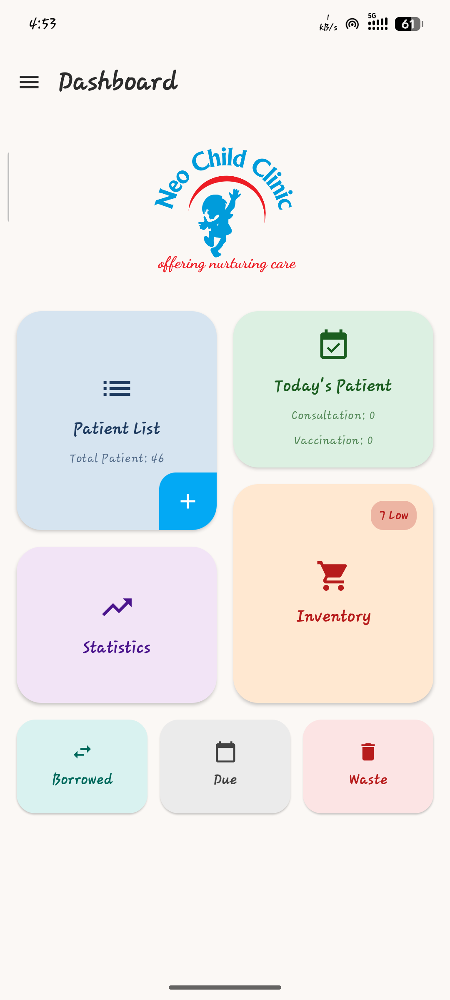
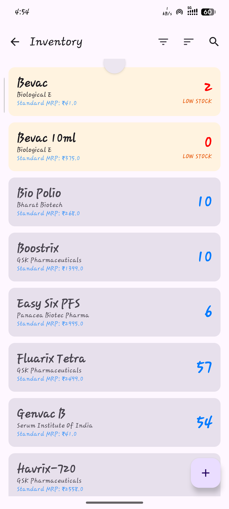

# Neo Child Clinic - Vaccine Manager

[](https://github.com/CyferBoy/Neo_Child_Clinic/releases/latest)
[](LICENSE)
[](#project-status)

Neo Child Clinic - Vaccine Manager is an Android application for pediatric clinics to manage patients, vaccinations, consultations, vaccine inventory, reminders, staff, and financial records.

The application uses an offline-first architecture with an encrypted local Room database and Supabase synchronization.

## Table of Contents

- [Overview](#overview)
- [Screenshots](#screenshots)
- [Releases & Updates](#releases--updates)
- [Features](#features)
- [Technology Stack](#technology-stack)
- [Architecture](#architecture)
- [Backend & Configuration](#backend--configuration)
- [Security & Privacy](#security--privacy)
- [Contributing](#contributing)
- [Getting Started](#getting-started)
- [Support](#support)
- [License](#license)
- [Disclaimer](#disclaimer)

---

## Overview

- **Version:** 0.5.1
- **Version Code:** 3
- **Minimum Android:** 10.0 (API 29)
- **Target Android:** 15 (API 35)
- **Status:** 🟢 Active Development

Neo Child Clinic - Vaccine Manager is actively developed and maintained. Features, database structures, and backend services may change between releases.

---

## Screenshots

Click any screenshot to open it at full size.

<table>
<tr>
<td align="center"><a href="docs/Screenshot/dashboard.png" target="_blank"><br>Dashboard</a></td>
<td align="center"><a href="docs/Screenshot/patient%20details.png" target="_blank"><br>Patient Details</a></td>
<td align="center"><a href="docs/Screenshot/due%20vaccination.png" target="_blank"><br>Due Vaccination</a></td>
</tr>
<tr>
<td align="center"><a href="docs/Screenshot/inventory.png" target="_blank"><br>Inventory</a></td>
<td align="center"><a href="docs/Screenshot/borrow%20vaccine.png" target="_blank"><br>Borrow Vaccine</a></td>
<td align="center"><a href="docs/Screenshot/app%20drawer.png" target="_blank"><br>Navigation Drawer</a></td>
</tr>
</table>

---

## Releases & Updates

### Releases

Official application releases are published on the project's GitHub Releases page.

<a href="https://github.com/CyferBoy/Neo_Child_Clinic/releases" target="_blank">📦 View & Download Releases</a>

### Updates

Application updates are provided through the **in-app update system**. The app checks GitHub Releases for newer versions, shows an in-app update prompt, and lets users download and install the new APK. Mandatory updates can require users to update before continuing. Users can also manually check for updates from Settings.

<a href="https://github.com/CyferBoy/Neo_Child_Clinic/releases" target="_blank">📝 View Release Changelog</a>

---

## Features

### 👶 Patient Management

- Create, edit, search, and manage patient records.
- Automatic patient ID and age calculation.
- Patient vaccination and consultation history.
- Patient notes and todos.
- Merge duplicate patient records.
- Attach patient documents, photos, and lab reports.
- Search by patient details, vaccine names, and receipt numbers.
- View and print/download vaccination and consultation receipts.

### 💉 Vaccination

- Add and edit vaccination visits.
- Add multiple vaccines to a single visit.
- Select vaccine batches and quantities from inventory.
- Prevent use of expired or unavailable stock.
- Track vaccination payments, including Cash and Online/UPI.
- Automatically update inventory when vaccinations are recorded or edited.
- Generate vaccination receipts.

**Next Vaccination**

- Date-first scheduling.
- Add multiple due dates to one record.
- Add multiple Type + Vaccine entries under the same due date.
- Edit or cancel individual scheduled vaccination items.
- Automatic vaccination reminders.

### 🩺 Consultation

- Add and edit consultations.
- Select doctor/staff member.
- Record consultation fees and clinical notes.
- Set follow-up dates.
- Add consultation todos.
- Generate consultation receipts.

### 📦 Vaccine Inventory

- Manage vaccines and vaccine batches.
- Add stock for multiple vaccines at once.
- Add multiple batches for each vaccine in a single stock operation.
- Track stock deductions and adjustments.
- View complete stock transaction history.
- Track borrowed vaccines and returns.
- Record vaccine wastage.
- Reconcile inventory.

### 💰 Finance

- Record and manage expenses.
- Track financial transactions.
- View financial summaries and monthly details.
- Calculate vaccination and consultation financial data.

### 🔔 Reminders & Notifications

- Vaccination due reminders.
- Personal reminders with priority and status.
- Background reminder notifications.
- Reminder history and audit tracking.

### 👥 Staff & Access

- Manage clinic staff.
- Staff profiles and details.
- Role-based access and permissions.
- Authentication and controlled clinic access.

### 📊 Dashboard & Statistics

- Clinic dashboard.
- Today's patients.
- Vaccination and patient statistics.
- Patient milestones.
- Finance and expense statistics.

### 📄 Documents & Records

- Store and manage patient documents.
- Patient vaccination cards and records.
- Receipts and printable records.
- Audit logs for important clinic activity.

### ☁️ Offline & Sync

- Offline-first local database.
- Automatic synchronization with Supabase.
- Sync queue and retry handling.
- Refresh data manually when needed.

### 📱 Home Screen Widget

- Vaccine due information on the Android home screen.
- Widget refresh support.
- Configurable widget settings.

### 🔄 In-App Updates

- Check GitHub Releases for newer versions.
- In-app update prompt with release information.
- Download and install the latest APK from the app.
- Mandatory update support.
- Manual update check from Settings.

---

## Technology Stack

- Kotlin
- Jetpack Compose
- Material 3
- MVVM / Clean Architecture
- Hilt
- Room
- SQLCipher
- WorkManager
- Supabase
- Firebase Cloud Messaging
- GitHub Releases

---

## Architecture

The application follows a layered architecture:

```
UI
│
├── Jetpack Compose
├── ViewModels
└── Navigation
      │
      ▼
Domain
│
├── Use Cases
├── Domain Models
└── Repository Interfaces
      │
      ▼
Data
│
├── Repositories
├── Room / SQLCipher
├── Sync Manager
└── Supabase
      │
      ├── PostgreSQL
      ├── Auth
      ├── Realtime
      └── Storage
```

Background tasks such as synchronization and reminders are handled using WorkManager.

---


## Backend & Configuration

### Backend

Supabase is used for:

- Authentication
- PostgreSQL database
- Row Level Security
- Realtime
- Storage
- Edge Functions

The project includes Edge Functions for privileged staff management and application-release notifications.

### Configuration & Secrets

Required application configuration:

```
NEXT_PUBLIC_SUPABASE_URL
NEXT_PUBLIC_SUPABASE_PUBLISHABLE_KEY
```

Firebase configuration is required for notification functionality.

Never commit:

- Supabase service-role keys.
- Firebase service-account credentials.
- Private signing keys.
- Production secrets.
- Other sensitive credentials.

The Supabase publishable key is a client-side key and should not be treated as a server secret. Backend access must be protected using authentication and RLS.

### Database

The application uses:

- Room + SQLCipher for encrypted local storage.
- Supabase PostgreSQL for cloud storage.
- Room migrations for supported local database upgrades.
- Supabase migrations for backend schema and security changes.

Current Room database version:

```
22
```

Supabase migrations are stored in:

```
supabase/migrations/
```

## Security & Privacy

If you discover a security vulnerability, please follow the instructions in [SECURITY.md](SECURITY.md). Do not publicly disclose security vulnerabilities before they have been reviewed.

The application may handle sensitive clinic information including patient, vaccination, consultation, financial, and staff data.

Production deployments should properly configure:

- Supabase RLS.
- Storage policies.
- Authentication.
- Edge Function secrets.
- Staff permissions.
- Database backup and recovery.

The application provides local database encryption and application security features, but secure deployment also depends on correct backend configuration.

---

## Contributing

Contributions, bug reports, and suggestions are welcome.

Before submitting changes:

1. Check existing issues and pull requests.
2. Keep changes focused and documented.
3. Run unit tests.
4. Run lint checks.
5. Verify database changes include the required migrations.
6. Test synchronization-related changes carefully.
7. Do not commit secrets or production credentials.

---

## Getting Started

Want to set up the project locally?

<a href="docs/GETTING_STARTED.md" target="_blank">🚀 Open the Getting Started Guide</a>

The separate guide contains the complete setup instructions for Android Studio, JDK/SDK, Supabase, Firebase, local environment configuration, Edge Functions, building, testing, and initial clinic setup.

## Support

For application support:

neochildclinic.sbg@gmail.com

---

## License

This project is licensed under the Apache License, Version 2.0.

See [LICENSE](LICENSE) for the complete license.

---

## Disclaimer

Neo Child Clinic - Vaccine Manager is clinic-management software and does not replace professional medical judgment.

Clinic administrators are responsible for:

- Correct patient data entry.
- Correct vaccination schedules.
- Appropriate staff permissions.
- Data protection.
- Backup and recovery.
- Compliance with applicable healthcare and privacy requirements.

Always verify clinical and financial information before relying on it for patient care or accounting.
